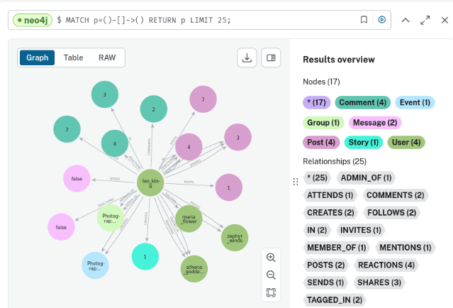
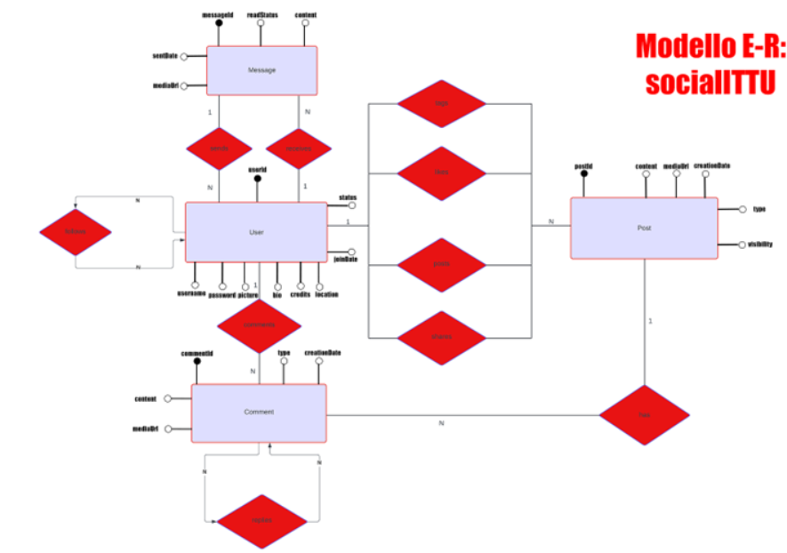

# New_Generation_Database
In questo corso magistrale si concentra nello studio e lo sviluppo di database moderni. Questa materia non tratta concetti di Base di Dati ma la sua evoluzione e gli strumenti che si sono creati negli ultimi anni. In questo repository non troverete script o altro , se volete sapere nei dettagli come sviluppare il progetto , vi invito a scrivermi un email. Mi farebbe molto piacere 

## PROGETTO: Modellazione di un Social Network che utilizza Database a Grafo mediante Neo4j "socialITTU"



#### Obiettivo del Progetto
Il progetto ha lo scopo di sviluppare un social network chiamato **socialITTU** utilizzando **Neo4j**, un database a grafo. La struttura a grafo permette una gestione efficiente delle relazioni tra utenti, post, commenti e messaggi, ottimizzando interrogazioni e navigazione dei dati. 

#### Motivazione
I social network sono sistemi altamente connessi, ideali per l'uso di database a grafo. Rispetto ai database relazionali tradizionali, **Neo4j** consente di rappresentare le relazioni in modo esplicito, facilitando query complesse come il "trovare amici di amici", raccomandazioni, o l'analisi di comunità.

#### Vantaggi di Neo4j
1. **Efficienza nelle relazioni**: Le relazioni sono entità di prima classe, memorizzate direttamente con i nodi, rendendo più veloce l'accesso rispetto a database tradizionali.
2. **Navigazione rapida**: La struttura a grafo consente una rapida traversata dei nodi.
3. **Query complesse**: Il linguaggio **Cypher** permette di creare interrogazioni espressive e descrivere pattern complessi tra i dati.
4. **Flessibilità**: Il modello di grafo è facilmente adattabile a nuovi tipi di nodi e relazioni senza dover ristrutturare l'intero schema.

---

### Architettura di Neo4j

Neo4j organizza i dati in:
- **Nodi**: Rappresentano le entità (es. utenti, post, commenti).
- **Relazioni**: Connessioni tra nodi che esprimono legami (es. un utente segue un altro utente, un post riceve un commento).
- **Proprietà**: Attributi associati sia ai nodi che alle relazioni (es. data di creazione, contenuto del post).
- **Query Cypher**: Linguaggio di interrogazione ottimizzato per grafi.

---
### Progettazione del modello E-R
La progettazione del modello E-R (Entità-Relazione) ha, quindi, comportato la definizione delle entità principali (User, Message, Comment, Post) e delle loro relazioni. Abbiamo identificato i seguenti attributi per ciascuna entità e relazione: 

- User: userId, username, password, picture, bio, credits, location, joinDate, status 
- Message: messageId, content, readStatus, sentDate, mediaUrls, type 
- Comment: commentId, content, mediaUrls, creationDate, type 
- Post: postId, content, mediaUrls, creationDate, type, visibility 
- FOLLOWS: (User)-[FOLLOWS]->(User) 
- POSTS: (User)-[POSTS]->(Post) 
- COMMENTS: (Post)-[COMMENTS]->(Comment),  
- (Comment)-[REPLIES]->(Comment) 
- LIKES: (User)-[LIKES]->(Post) 
- RECEIVES: (User)-[RECEIVES]->(Message) 
- SENDS: (User)-[SENDS]->(Message) 
- SHARES: (User)-[SHARES]->(Post) 
- TAGS: (User)-[TAGS]->(Post) 


### Conversione Entita-Relazioni con Nodi e Archi 
## Nodi

- **User**: Rappresentato come nodo con le seguenti proprietà:
  - `userId`
  - `username`
  - `password`
  - `picture`
  - `bio`
  - `credits`
  - `location`
  - `joinDate`
  - `status`

- **Message**: Rappresentato come nodo con le seguenti proprietà:
  - `messageId`
  - `content`
  - `readStatus`
  - `sentDate`
  - `mediaUrls`
  - `type`

- **Comment**: Rappresentato come nodo con le seguenti proprietà:
  - `commentId`
  - `content`
  - `mediaUrls`
  - `creationDate`
  - `type`

- **Post**: Rappresentato come nodo con le seguenti proprietà:
  - `postId`
  - `content`
  - `mediaUrls`
  - `creationDate`
  - `type`
  - `visibility`

## Archi

- **FOLLOWS**: Arco che collega due nodi **User**.
- **POSTS**: Arco che collega un nodo **User** con un nodo **Post**.
- **COMMENTS**: Arco che collega un nodo **User** con un nodo **Comment**, specifica quale utente ha scritto quale commento.
- **ON**: Arco che collega un nodo **Comment** con un nodo **Post** o un altro nodo **Comment** (se è annidato).
- **LIKES**: Arco che collega un nodo **User** con un nodo **Post**


### Modello di Dati del Social Network

Il modello di dati è composto da:
- **Entità** principali: *User*, *Post*, *Comment*, *Message*.
- **Relazioni** tra entità: *follows*, *likes*, *posts*, *comments*, *shares*.
  
Esempio di alcune relazioni chiave:
- `(User)-[:FOLLOWS]->(User)`
- `(User)-[:POSTS]->(Post)`
- `(Post)-[:COMMENTS]->(Comment)`

---

### Script fondamentali utilizzati

1. **Creazione di nodi utenti**:
    ```cypher
    CREATE (u1:User {userId: 1, username: "leo_king", password: "pwd123", picture: "leo_pic.jpg", bio: "Aspiring artist", credits: 20, location: "Rome", joinDate: date("2023-01-01"), status: "active"});
    ```

2. **Creazione di post**:
    ```cypher
    CREATE (p1:Post {postId: 1, content: "Exploring the ancient ruins today!", creationDate: datetime("2023-07-01T10:00:00"), mediaUrls: ["post_pic1.jpg"], type: "photo"});
    ```

3. **Creazione di commenti**:
    ```cypher
    CREATE (c1:Comment {commentId: 1, content: "Amazing ruins!", creationDate: datetime(), mediaUrls: [], type: "text"});
    ```

4. **Creazione di relazioni tra utenti (follows)**:
    ```cypher
    MATCH (u1:User {userId: 1}), (u2:User {userId: 2})
    CREATE (u1)-[:FOLLOWS]->(u2);
    ```

5. **Creazione di relazioni tra utenti e post (posts)**:
    ```cypher
    MATCH (u1:User {userId: 1}), (p1:Post {postId: 1})
    CREATE (u1)-[:POSTS]->(p1);
    ```

6. **Creazione di relazioni tra post e commenti (comments)**:
    ```cypher
    MATCH (u2:User {userId: 2}), (p1:Post {postId: 1}), (c1:Comment {commentId: 1})
    CREATE (u2)-[:COMMENTS]->(c1)-[:ON]->(p1);
    ```

### Query di Analisi Base

1. **Visualizzare utenti e i loro post**:
    ```cypher
    MATCH (u:User)-[:POSTS]->(p:Post)
    RETURN u.username, p.content, p.creationDate;
    ```

2. **Visualizzare tutti i commenti su un post**:
    ```cypher
    MATCH (p:Post)<-[:ON]-(c:Comment)
    RETURN p.content, c.content;
    ```

3. **Conteggio like per ogni post**:
    ```cypher
    MATCH (u:User)-[:LIKES]->(p:Post)
    RETURN p.postId, COUNT(u) AS NumberOfLikes;
    ```

### Query Avanzate

#### 1. **Post più popolari (in base a like, commenti e condivisioni)**
Questa query calcola la popolarità di ogni post combinando il numero di like, commenti e condivisioni.
```cypher
MATCH (p:Post)
OPTIONAL MATCH (p)<-[:LIKES]-(u:User)
WITH p, COUNT(u) AS likeCount
OPTIONAL MATCH (p)<-[:ON]-(c:Comment)
WITH p, likeCount, COUNT(c) AS commentCount
OPTIONAL MATCH (p)<-[:SHARES]-(s:User)
RETURN p.postId AS PostID, 
       likeCount + commentCount + COUNT(s) AS PopularityScore
ORDER BY PopularityScore DESC;
```

#### 2. **Utenti più attivi (in base a post, commenti e messaggi inviati)**
Questa query calcola un punteggio di attività per ogni utente basato sul numero di post, commenti e messaggi inviati.
```cypher
MATCH (u:User)
OPTIONAL MATCH (u)-[:POSTS]->(p:Post)
WITH u, COUNT(p) AS postCount
OPTIONAL MATCH (u)-[:COMMENTS]->(c:Comment)
WITH u, postCount, COUNT(c) AS commentCount
OPTIONAL MATCH (u)-[:SENDS]->(m:Message)
RETURN u.username AS Username, 
       postCount + commentCount + COUNT(m) AS ActivityScore
ORDER BY ActivityScore DESC;
```

#### 3. **Distribuzione degli utenti per località**
Questa query restituisce la distribuzione degli utenti in base alla loro località.
```cypher
MATCH (u:User)
RETURN u.location AS Location, COUNT(u) AS NumberOfUsers
ORDER BY NumberOfUsers DESC;
```

#### 4. **Tempo medio di risposta ai commenti**
Questa query calcola il tempo medio di risposta tra i commenti e le relative risposte.
```cypher
MATCH (parent:Comment)-[:ON]->(descendant:Comment)
WITH parent, descendant, duration.between(parent.creationDate, descendant.creationDate) AS responseTime
WHERE responseTime.seconds > 0  // Considera solo risposte con tempo positivo
RETURN AVG(responseTime.seconds / 3600.0) AS AverageResponseTime;
```

#### 5. **Utenti con il maggior numero di follower**
Questa query restituisce l'elenco degli utenti con il maggior numero di follower.
```cypher
MATCH (u:User)<-[:FOLLOWS]-(f:User)
RETURN u.username AS Username, COUNT(f) AS NumberOfFollowers
ORDER BY NumberOfFollowers DESC;
```

#### 6. **Numero medio di like per post per ciascun utente**
Questa query calcola la media di like ricevuti per ciascun post pubblicato da ogni utente.
```cypher
MATCH (u:User)-[:POSTS]->(p:Post)
OPTIONAL MATCH (p)<-[:LIKES]-(l:User)
WITH u, p, COUNT(l) AS LikeCount
WITH u, AVG(LikeCount) AS AverageLikesPerPost
RETURN u.username AS Username, AverageLikesPerPost
ORDER BY AverageLikesPerPost DESC;
```

#### 7. **Post con più interazioni (like, commenti e condivisioni)**
Questa query restituisce i post con il maggior numero di interazioni (somma di like, commenti e condivisioni).
```cypher
MATCH (p:Post)
OPTIONAL MATCH (p)<-[:LIKES]-(u:User)
WITH p, COUNT(u) AS likeCount
OPTIONAL MATCH (p)<-[:ON]-(c:Comment)
WITH p, likeCount, COUNT(c) AS commentCount
OPTIONAL MATCH (p)<-[:SHARES]-(s:User)
RETURN p.postId AS PostID, 
       likeCount + commentCount + COUNT(s) AS InteractionScore
ORDER BY InteractionScore DESC;
```

---

### Aggiornamenti dinamici del social network

#### 8. **Aggiungere un gruppo e contare membri e post**
Supponiamo di dover gestire i gruppi all'interno del social network, possiamo creare nodi di tipo **Group** e gestire gli attributi come `memberCount` e `postCount` direttamente nel nodo.
```cypher
CREATE (g:Group {groupId: 1, name: "Photography Lovers", description: "A group for those who love capturing moments", creationDate: date("2023-01-15"), memberCount: 0, postCount: 0});
```

#### 9. **Aggiungere eventi e invitare utenti**
Per creare nodi **Event** e invitare utenti:
```cypher
CREATE (e:Event {eventId: 1, name: "Photography Walk", description: "Exploring the city with fellow photographers.", date: date("2023-08-01"), location: "Rome, Italy"});
```
Invitare utenti:
```cypher
MATCH (u:User {userId: 1}), (e:Event {eventId: 1})
CREATE (u)-[:INVITED_TO]->(e);
```

---


